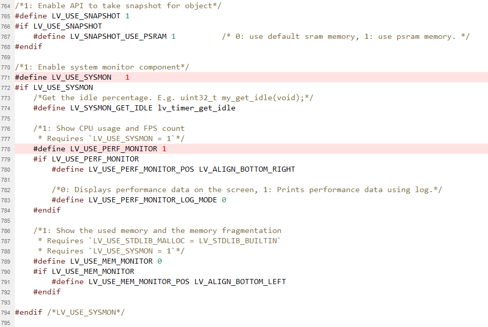
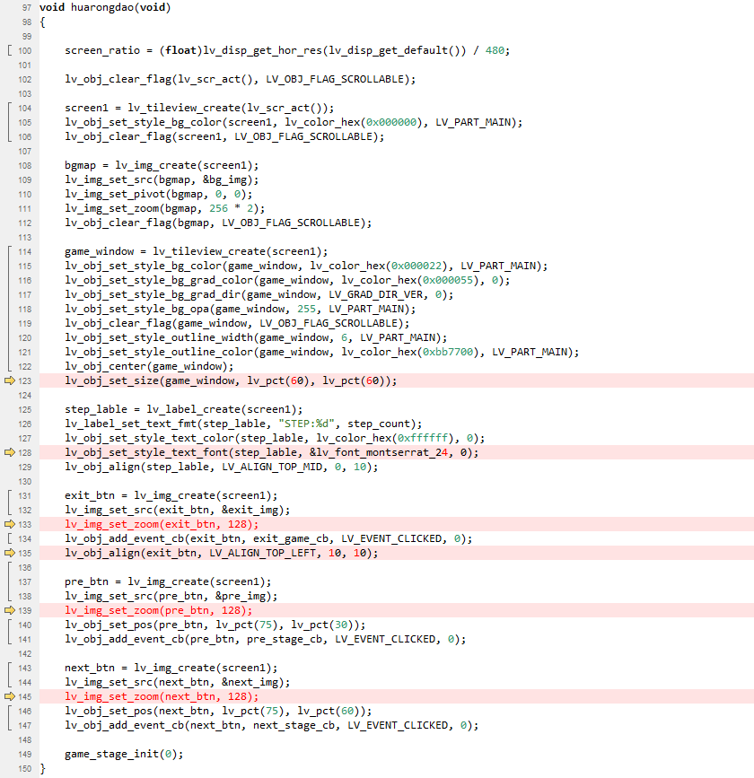
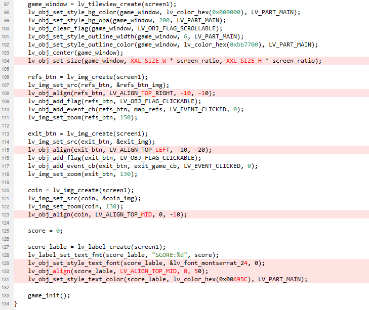
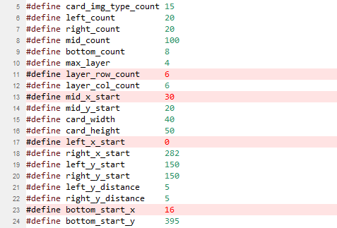
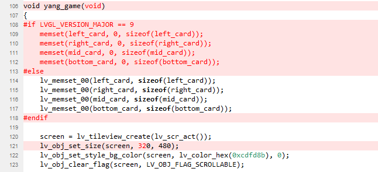
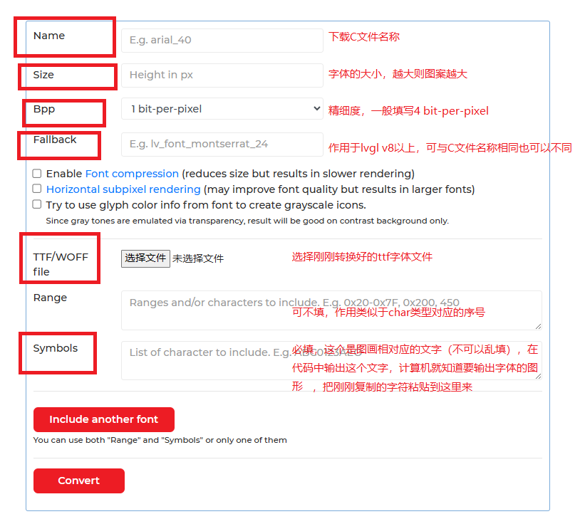
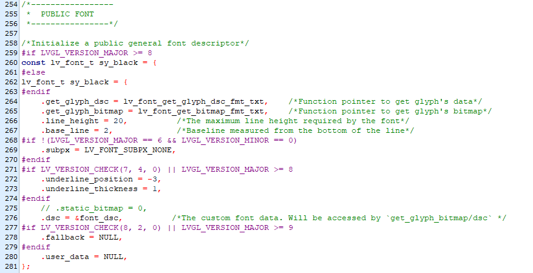


基于涂鸦T5AI-Board开发板移植游戏
# 一、硬件环境
实物使用`T5AI-Board`开发板，搭载一个3.5寸屏幕，开发环境使用`TuyaOpen`。

涂鸦 T5AI-Board 是一款基于 T5-E1-IPEX 的语音和屏幕多交互开发板，T5-E1-IPEX 是涂鸦智能开发的嵌入式 Wi-Fi 和蓝牙组合模块。该开发板配备 2 个麦克风和 1 个扬声器，支持语音识别和播放，提供语音交互功能。

通过开发板上的 I/O 连接器，您可以使用 LCD 显示堆叠模块来实现触摸屏和摄像头捕获功能。您还可以设计自己的 LCD 屏幕，支持多种接口，包括 I2C、SPI、8080 和 RGB 接口。

详细介绍参考：[https://tuyaopen.ai/zh/docs/hardware-specific/t5-ai-board/overview-t5-ai-board](https://tuyaopen.ai/zh/docs/hardware-specific/t5-ai-board/overview-t5-ai-board)


# 二、下载源码
使用git下载TuyaOpen源码
`git clone https://gitee.com/tuya-open/TuyaOpen.git`
或
`git clone https://github.com/tuya/TuyaOpen.git`

2048游戏源码来源
`git clone https://gitee.com/weidongshan/lv_lib_100ask`
植物大战僵尸、羊了个羊、消消乐、华容道的游戏源码来源
`git clone https://gitee.com/mgod_wu/AiPi-Eyes-Rx`
# 三、搭建开发环境
建议直接参考：[https://tuyaopen.ai/zh/docs/quick-start/enviroment-setup](https://tuyaopen.ai/zh/docs/quick-start/enviroment-setup)

每次重新打开cmd后，都需要执行`.\export.bat`进行开发环境的初始化

# 四、源码移植
## 1、修改TuyaOpen配置
由于小安派游戏中提供的图片数据中，16位数据的是`LV_COLOR_FORMAT_ARGB8565`格式，但实际测试RGB565带ALPHA的图像数据中只有`LV_COLOR_FORMAT_RGB565A8`格式可以正常显示。

两种格式的区别，`LV_COLOR_FORMAT_ARGB8565`格式是每个像素后会带一个ALPHA值，而`LV_COLOR_FORMAT_RGB565A8`格式是将ALPHA值放在所有颜色数据的后面。比如对于四个像素，
`LV_COLOR_FORMAT_ARGB8565`格式的排列是 `RGBA RGBA RGBA RGBA`，而`LV_COLOR_FORMAT_RGB565A8`格式的排列是 `RGB RGB RGB RGB AAAA`。

经过许久的尝试，最终放弃在涂鸦开发板中显示`LV_COLOR_FORMAT_ARGB8565`格式的数据，刚好游戏中给出的图片数据还支持了RGB888的32位深度。需修改涂鸦源码的配置文件。
修改`TuyaOpen\src\liblvgl\conf\lv_conf.h`第38行的`LV_COLOR_DEPTH`改为32位

同时可在该文件中开启CPU和FPS信息显示，默认为不开启状态

## 2、修改LVGL版本适配
本次移植是基于`TuyaOpen\examples\graphics\lvgl_demo`项目进行修改

由于小安派中的源码版本是基于 LVGL v8 版本的，但涂鸦中默认使用的是 v9 版本，所以需要修改一些配置，将`AiPi-Eyes-Rx\demos\lv_demos.h`复制到`src`目录中，改名为`lv_games.h`

增加宏定义，主要用于兼容 LVGL v8
```c

// 用于T5AI-BOARD适配
#if LV_COLOR_DEPTH == 32 && LV_COLOR_16_SWAP == 0 && LVGL_VERSION_MAJOR == 9
    #ifndef LV_IMG_PX_SIZE_ALPHA_BYTE
    #define LV_IMG_PX_SIZE_ALPHA_BYTE   4
    #endif

    #ifndef LV_COLOR_SIZE
    #define LV_COLOR_SIZE               32
    #endif

    #ifndef LV_IMG_CF_TRUE_COLOCOLOR
    #define LV_IMG_CF_TRUE_COLOR        LV_COLOR_FORMAT_XRGB8888
    #endif

    #ifndef LV_IMG_CF_TRUE_COLOR_ALPHA
    #define LV_IMG_CF_TRUE_COLOR_ALPHA  LV_COLOR_FORMAT_ARGB8888
    #endif

	#define lv_obj_del_delayed          lv_obj_delete_delayed
#endif
```

修改小安派源码中的img定义，例如`exit_img.c`中，在文件头部增加
```c
#include "../lv_games.h"
```
在文件最后的图像定义中增加版本判断，因为v9版本中已去除`.header.always_zero`和`.header.reserved`
```c
const lv_img_dsc_t exit_img = {
  .header.cf = LV_IMG_CF_TRUE_COLOR_ALPHA,
#if LVGL_VERSION_MAJOR == 8
  .header.always_zero = 0,
  .header.reserved = 0,
#endif
  .header.w = 100,
  .header.h = 100,
  .data_size = 10000 * LV_IMG_PX_SIZE_ALPHA_BYTE,
  .data = exit_img_map,
};
```


对于小安派的所有img图片的定义均参考修改，后续不再赘述。
## 3、移植2048游戏

 1. 将下载的源码中的src\lv_100ask_2048目录下的.c和.h与examples\lv_100ask_2048合并。
 2. 在.c文件中增加禁止页面滑动，防止在游戏的过程中影响触感。
```c
    screen_2048 = lv_tileview_create(lv_scr_act());
    lv_obj_set_scroll_dir(screen_2048, LV_DIR_NONE);
    lv_obj_set_scrollbar_mode(screen_2048, LV_SCROLLBAR_MODE_OFF);
```
## 4、移植华容道游戏
华容道游戏整体运行无大的异常，所以只进行对于界面布局方面的修改，主要是修改了游戏区域的大小，以及界面上三个按钮缩小了一倍。
```c
void huarongdao(void)
{

    screen_ratio = (float)lv_disp_get_hor_res(lv_disp_get_default()) / 480;

    lv_obj_clear_flag(lv_scr_act(), LV_OBJ_FLAG_SCROLLABLE);

    screen1 = lv_tileview_create(lv_scr_act());
    lv_obj_set_style_bg_color(screen1, lv_color_hex(0x000000), LV_PART_MAIN);
    lv_obj_clear_flag(screen1, LV_OBJ_FLAG_SCROLLABLE);

    bgmap = lv_img_create(screen1);
    lv_img_set_src(bgmap, &bg_img);
    lv_img_set_pivot(bgmap, 0, 0);
    lv_img_set_zoom(bgmap, 256 * 2);
    lv_obj_clear_flag(bgmap, LV_OBJ_FLAG_SCROLLABLE);

    game_window = lv_tileview_create(screen1);
    lv_obj_set_style_bg_color(game_window, lv_color_hex(0x000022), LV_PART_MAIN);
    lv_obj_set_style_bg_grad_color(game_window, lv_color_hex(0x000055), 0);
    lv_obj_set_style_bg_grad_dir(game_window, LV_GRAD_DIR_VER, 0);
    lv_obj_set_style_bg_opa(game_window, 255, LV_PART_MAIN);
    lv_obj_clear_flag(game_window, LV_OBJ_FLAG_SCROLLABLE);
    lv_obj_set_style_outline_width(game_window, 6, LV_PART_MAIN);
    lv_obj_set_style_outline_color(game_window, lv_color_hex(0xbb7700), LV_PART_MAIN);
    lv_obj_center(game_window);
    lv_obj_set_size(game_window, lv_pct(60), lv_pct(60));

    step_lable = lv_label_create(screen1);
    lv_label_set_text_fmt(step_lable, "STEP:%d", step_count);
    lv_obj_set_style_text_color(step_lable, lv_color_hex(0xffffff), 0);
    lv_obj_set_style_text_font(step_lable, &lv_font_montserrat_24, 0);
    lv_obj_align(step_lable, LV_ALIGN_TOP_MID, 0, 10);

    exit_btn = lv_img_create(screen1);
    lv_img_set_src(exit_btn, &exit_img);
    lv_img_set_zoom(exit_btn, 128);
    lv_obj_add_event_cb(exit_btn, exit_game_cb, LV_EVENT_CLICKED, 0);
    lv_obj_align(exit_btn, LV_ALIGN_TOP_LEFT, 10, 10);

    pre_btn = lv_img_create(screen1);
    lv_img_set_src(pre_btn, &pre_img);
    lv_img_set_zoom(pre_btn, 128);
    lv_obj_set_pos(pre_btn, lv_pct(75), lv_pct(30));
    lv_obj_add_event_cb(pre_btn, pre_stage_cb, LV_EVENT_CLICKED, 0);

    next_btn = lv_img_create(screen1);
    lv_img_set_src(next_btn, &next_img);
    lv_img_set_zoom(next_btn, 128);
    lv_obj_set_pos(next_btn, lv_pct(75), lv_pct(60));
    lv_obj_add_event_cb(next_btn, next_stage_cb, LV_EVENT_CLICKED, 0);

    game_stage_init(0);
}
```

## 5、移植消消乐游戏
消消乐游戏本身也是可以正常运行的，但是由于默认的图像界面显示很小，导致触摸不方便，所以修改了游戏区域的大小，以及重排了按钮的位置。
```c
// 整体的宽度
#define XXL_SIZE_W  440
#define XXL_SIZE_H  440
#define XXL_IMG_W   (XXL_SIZE_W/8)
#define XXL_IMG_H   (XXL_SIZE_H/8)
void xiaoxiaole(void)
{
    if (lv_disp_get_hor_res(lv_disp_get_default()) >= lv_disp_get_ver_res(lv_disp_get_default())) {
        screen_ratio = (float)lv_disp_get_ver_res(lv_disp_get_default()) / 400;
    } else {
        screen_ratio = (float)lv_disp_get_hor_res(lv_disp_get_default()) / 480;
    }

    lv_obj_clear_flag(lv_scr_act(), LV_OBJ_FLAG_SCROLLABLE);

    screen1 = lv_tileview_create(lv_scr_act());
    lv_obj_set_style_bg_color(screen1, lv_color_hex(0x000000), LV_PART_MAIN);
    lv_obj_clear_flag(screen1, LV_OBJ_FLAG_SCROLLABLE);

    //////////////////////////////////////////////////////////////////////////////////////
    bgmap = lv_img_create(screen1);
    lv_img_set_src(bgmap, &xiaoxiaole_bg_img);
    lv_img_set_pivot(bgmap, 0, 0);
    lv_img_set_zoom(bgmap, 256 * 1.5 * 1.2);
    lv_obj_clear_flag(bgmap, LV_OBJ_FLAG_SCROLLABLE);
    ///////////////////////////////////////////////////////////////////////////////////

    game_window = lv_tileview_create(screen1);
    lv_obj_set_style_bg_color(game_window, lv_color_hex(0x000000), LV_PART_MAIN);
    lv_obj_set_style_bg_opa(game_window, 200, LV_PART_MAIN);
    lv_obj_clear_flag(game_window, LV_OBJ_FLAG_SCROLLABLE);
    lv_obj_set_style_outline_width(game_window, 6, LV_PART_MAIN);
    lv_obj_set_style_outline_color(game_window, lv_color_hex(0xbb7700), LV_PART_MAIN);
    lv_obj_center(game_window);
    lv_obj_set_size(game_window, XXL_SIZE_W * screen_ratio, XXL_SIZE_H * screen_ratio);

    refs_btn = lv_img_create(screen1);
    lv_img_set_src(refs_btn, &refs_btn_img);
    lv_obj_align(refs_btn, LV_ALIGN_TOP_RIGHT, -10, -10);
    lv_obj_add_flag(refs_btn, LV_OBJ_FLAG_CLICKABLE);
    lv_obj_add_event_cb(refs_btn, map_refs, LV_EVENT_CLICKED, 0);
    lv_img_set_zoom(refs_btn, 150);

    exit_btn = lv_img_create(screen1);
    lv_img_set_src(exit_btn, &exit_img);
    lv_obj_align(exit_btn, LV_ALIGN_TOP_LEFT, -10, -20);
    lv_obj_add_flag(exit_btn, LV_OBJ_FLAG_CLICKABLE);
    lv_obj_add_event_cb(exit_btn, exit_game_cb, LV_EVENT_CLICKED, 0);
    lv_img_set_zoom(exit_btn, 130);

    coin = lv_img_create(screen1);
    lv_img_set_src(coin, &coin_img);
    lv_img_set_zoom(coin, 130);
    lv_obj_align(coin, LV_ALIGN_TOP_MID, 0, -10);

    score = 0;

    score_lable = lv_label_create(screen1);
    lv_label_set_text_fmt(score_lable, "SCORE:%d", score);
    lv_obj_set_style_text_font(score_lable, &lv_font_montserrat_24, 0);
    lv_obj_align(score_lable, LV_ALIGN_TOP_MID, 0, 50);
    lv_obj_set_style_text_color(score_lable, lv_color_hex(0x00695C), LV_PART_MAIN);

    game_init();
}
```

## 6、移植羊了个羊游戏
 3. 修改`lv_memset_00`函数为```memset```函数
 4. 修改屏幕的尺寸为320x480
 5. 修改单行对应的元素个数为6个，原有8个太宽，无法完全显示
 6. 修改多个元素的x起点坐标位置，用于将整体图像左移
```c
#define card_img_type_count 15
#define left_count          20
#define right_count         20
#define mid_count           100
#define bottom_count        8
#define max_layer           4
#define layer_row_count     6
#define layer_col_count     6
#define mid_x_start         30
#define mid_y_start         20
#define card_width          40
#define card_height         50
#define left_x_start        0
#define right_x_start       282
#define left_y_start        150
#define right_y_start       150
#define left_y_distance     5
#define right_y_distance    5
#define bottom_start_x      16
#define bottom_start_y      395
```

```c
void yang_game(void)
{
#if LVGL_VERSION_MAJOR == 9
    memset(left_card, 0, sizeof(left_card));
    memset(right_card, 0, sizeof(right_card));
    memset(mid_card, 0, sizeof(mid_card));
    memset(bottom_card, 0, sizeof(bottom_card));
#else
    lv_memset_00(left_card, sizeof(left_card));
    lv_memset_00(right_card, sizeof(right_card));
    lv_memset_00(mid_card, sizeof(mid_card));
    lv_memset_00(bottom_card, sizeof(bottom_card));
#endif

    screen = lv_tileview_create(lv_scr_act());
    lv_obj_set_size(screen, 320, 480);
    lv_obj_set_style_bg_color(screen, lv_color_hex(0xcdfd8b), 0);
    lv_obj_clear_flag(screen, LV_OBJ_FLAG_SCROLLABLE);

    for (int i = 0; i < 20; i++) {
        lv_obj_t *g = lv_img_create(screen);
        lv_img_set_src(g, grass_img[rand() % 2]);
        lv_obj_set_pos(g, rand() % 450, rand() % 450);
    }

    dock = lv_img_create(screen);
    lv_img_set_src(dock, &bottom_dock_img);
    lv_obj_align(dock, LV_ALIGN_BOTTOM_MID, 0, -5);

    start_btn = lv_img_create(screen);
    lv_img_set_src(start_btn, &yang_start_btn_img);
    lv_obj_center(start_btn);
    lv_obj_add_flag(start_btn, LV_OBJ_FLAG_CLICKABLE);
    lv_obj_add_event_cb(start_btn, game_start, LV_EVENT_RELEASED, 0);
}
````

## 7、移植植物大战僵尸游戏
 1. 修改`lv_memset_00`函数为```memset```函数
 2. 将界面旋转`90`度
```c
void pvz_start(void)
{
#if LVGL_VERSION_MAJOR == 9
    memset(zb_matrix, 0, sizeof(zb_matrix));
    memset(map_flag, 0, sizeof(map_flag));
    memset(wogua, 0, sizeof(wogua));
    memset(add_zidan_timer, 0, sizeof(add_zidan_timer));
    memset(sunflower, 0, sizeof(sunflower));
    memset(wandouflower, 0, sizeof(wandouflower));
    memset(jiguangdou, 0, sizeof(jiguangdou));
    memset(shine, 0, sizeof(shine));
    memset(zidan, 0, sizeof(zidan));
    memset(little_car, 0, sizeof(little_car));
#else
    lv_memset_00(zb_matrix, sizeof(zb_matrix));
    lv_memset_00(map_flag, sizeof(map_flag));
    lv_memset_00(wogua, sizeof(wogua));
    lv_memset_00(add_zidan_timer, sizeof(add_zidan_timer));
    lv_memset_00(sunflower, sizeof(sunflower));
    lv_memset_00(wandouflower, sizeof(wandouflower));
    lv_memset_00(jiguangdou, sizeof(jiguangdou));
    lv_memset_00(shine, sizeof(shine));
    lv_memset_00(zidan, sizeof(zidan));
    lv_memset_00(little_car, sizeof(little_car));
#endif
    screen = lv_tileview_create(lv_scr_act());
    lv_obj_set_size(screen, 480, 320);
    lv_obj_center(screen);
    lv_obj_clear_flag(screen, LV_OBJ_FLAG_SCROLLABLE);
    map1 = lv_img_create(screen);
    lv_obj_set_size(map1, 480, 320);
    lv_obj_center(screen);
    lv_img_set_src(map1, &pvz_map_3);
    lv_obj_clear_flag(map1, LV_OBJ_FLAG_SCROLLABLE);
    lv_obj_add_event_cb(map1, map_click_cb, LV_EVENT_RELEASED, 0);

    start_btn = lv_img_create(map1);
    lv_img_set_src(start_btn, &start_game_img);
    lv_obj_center(start_btn);
    lv_obj_add_flag(start_btn, LV_OBJ_FLAG_CLICKABLE);
    lv_obj_add_event_cb(start_btn, game_start, LV_EVENT_RELEASED, 0);
}
```
注意：植物大战僵尸游戏建议改为横屏使用，涂鸦开发板通过修改`TuyaOpen\boards\T5AI\TUYA_T5AI_BOARD`目录下的`tuya_t5ai_board.c`和`tuya_t5ai_ex_module.h`文件中的`#define BOARD_LCD_ROTATION`宏定义可修改初始旋转方向，两个文件需同时修改，否则会报错。
# 五、编写主界面程序
主界面中主要简单增加按钮，用于选择不同的游戏
```c
/**
 * @file lv_games.c
 * @brief LVGL (Light and Versatile Graphics Library) example for SDK.
 *
 * This file provides an example implementation of using the LVGL library with the Tuya SDK.
 * It demonstrates the initialization and usage of LVGL for graphical user interface (GUI) development.
 * The example covers setting up the display port, initializing LVGL, and running a demo application.
 *
 * The LVGL example aims to help developers understand how to integrate LVGL into their Tuya IoT projects for
 * creating graphical user interfaces on embedded devices. It includes detailed examples of setting up LVGL,
 * handling display updates, and integrating these functionalities within a multitasking environment.
 *
 * @note This example is designed to be adaptable to various Tuya IoT devices and platforms, showcasing fundamental LVGL
 * operations critical for GUI development on embedded systems.
 *
 * @copyright Copyright (c) 2021-2024 Tuya Inc. All Rights Reserved.
 *
 */

#include "tuya_cloud_types.h"

#include "tal_api.h"
#include "tkl_output.h"
#include "tkl_spi.h"
#include "tkl_system.h"

#include "lvgl.h"
#include "lv_vendor.h"
#include "board_com_api.h"
#include "lv_games.h"
#include "sy_black.c"
/***********************************************************
*************************micro define***********************
***********************************************************/

/***********************************************************
***********************typedef define***********************
***********************************************************/

/***********************************************************
***********************variable define**********************
***********************************************************/

LV_FONT_DECLARE(sy_black)   // 自定义字体
const lv_font_t * my_font = &sy_black;

/***********************************************************
***********************function define**********************
***********************************************************/

#if LV_USE_GAME_HUARONGDAO == 1     // 华容道
static void new_game_hrd_event_handler(lv_event_t *e)
{
    huarongdao();
}
#endif

#if LV_USE_GAME_XIAOXIAOLE == 1     // 消消乐
static void new_game_xxl_event_handler(lv_event_t *e)
{
    xiaoxiaole();
}
#endif

#if LV_USE_GAME_YANG == 1           // 羊了个羊
static void new_game_yang_event_handler(lv_event_t *e)
{
    yang_game();
}
#endif

#if LV_USE_GAME_PVZ == 1            // 植物大战僵尸
static void new_game_pvz_event_handler(lv_event_t *e)
{
    pvz_start();
}
#endif

#if LV_USE_GAME_2048 == 1           // 2048
static void new_game_2048_event_handler(lv_event_t *e)
{
    lv_2048_start();
}
#endif

/**
 * @brief user_main
 *
 * @param[in] param:Task parameters
 * @return none
 */
void user_main(void)
{
    int32_t y_pos = 55;
    /* basic init */
    tal_log_init(TAL_LOG_LEVEL_DEBUG, 4096, (TAL_LOG_OUTPUT_CB)tkl_log_output);

    /*hardware register*/
    board_register_hardware();

    lv_vendor_init(DISPLAY_NAME);

    lv_obj_t *scr_main = lv_tileview_create(lv_scr_act());
    lv_obj_set_style_bg_color(scr_main, lv_color_hex(0xf8f5f0), LV_PART_MAIN);
    lv_obj_set_scroll_dir(scr_main, LV_DIR_NONE);
    lv_obj_clear_flag(scr_main, LV_OBJ_FLAG_SCROLLABLE);
    lv_obj_set_scrollbar_mode(scr_main, LV_SCROLLBAR_MODE_OFF);

    #if LV_USE_GAME_HUARONGDAO == 1
        lv_obj_t * btn_hrd = lv_btn_create(scr_main);
        lv_obj_set_size(btn_hrd, 150, 50);
        lv_obj_align_to(btn_hrd, scr_main, LV_ALIGN_TOP_MID, 0, y_pos);
        lv_obj_add_event_cb(btn_hrd, new_game_hrd_event_handler, LV_EVENT_CLICKED, scr_main);

        lv_obj_t * lbl_hrd = lv_label_create(btn_hrd);
        lv_label_set_text(lbl_hrd, "华容道");
        lv_obj_set_style_text_font(lbl_hrd, my_font, 0);
        lv_obj_center(lbl_hrd);
        y_pos += 80;
    #endif

    #if LV_USE_GAME_XIAOXIAOLE == 1
        lv_obj_t * btn_xxl = lv_btn_create(scr_main);
        lv_obj_set_size(btn_xxl, 150, 50);
        lv_obj_align_to(btn_xxl, scr_main, LV_ALIGN_TOP_MID, 0, y_pos);
        lv_obj_add_event_cb(btn_xxl, new_game_xxl_event_handler, LV_EVENT_CLICKED, scr_main);

        lv_obj_t * lbl_xxl = lv_label_create(btn_xxl);
        lv_label_set_text(lbl_xxl, "消消乐");
        lv_obj_set_style_text_font(lbl_xxl, my_font, 0);
        lv_obj_center(lbl_xxl);
        y_pos += 80;
    #endif

    #if LV_USE_GAME_YANG == 1
        lv_obj_t * btn_yang = lv_btn_create(scr_main);
        lv_obj_set_size(btn_yang, 150, 50);
        lv_obj_align_to(btn_yang, scr_main, LV_ALIGN_TOP_MID, 0, y_pos);
        lv_obj_add_event_cb(btn_yang, new_game_yang_event_handler, LV_EVENT_CLICKED, scr_main);

        lv_obj_t * lbl_yang = lv_label_create(btn_yang);
        lv_label_set_text(lbl_yang, "羊了个羊");
        lv_obj_set_style_text_font(lbl_yang, my_font, 0);
        lv_obj_center(lbl_yang);
        y_pos += 80;
    #endif

    #if LV_USE_GAME_PVZ == 1
        lv_obj_t * btn_pvz = lv_btn_create(scr_main);
        lv_obj_set_size(btn_pvz, 150, 50);
        lv_obj_align_to(btn_pvz, scr_main, LV_ALIGN_TOP_MID, 0, y_pos);
        lv_obj_add_event_cb(btn_pvz, new_game_pvz_event_handler, LV_EVENT_CLICKED, scr_main);

        lv_obj_t * lbl_pvz = lv_label_create(btn_pvz);
        lv_label_set_text(lbl_pvz, "植物大战僵尸");
        lv_obj_set_style_text_font(lbl_pvz, my_font, 0);
        lv_obj_center(lbl_pvz);
        y_pos += 80;
    #endif

    #if LV_USE_GAME_2048 == 1
        lv_obj_t * btn_2048 = lv_btn_create(scr_main);
        lv_obj_set_size(btn_2048, 150, 50);
        lv_obj_align_to(btn_2048, scr_main, LV_ALIGN_TOP_MID, 0, y_pos);
        lv_obj_add_event_cb(btn_2048, new_game_2048_event_handler, LV_EVENT_CLICKED, scr_main);

        lv_obj_t * lbl_2048 = lv_label_create(btn_2048);
        lv_label_set_text(lbl_2048, "2048");
        lv_obj_set_style_text_font(lbl_2048, my_font, 0);
        lv_obj_center(lbl_2048);
        y_pos += 80;
    #endif

    lv_vendor_start();
}

/**
 * @brief main
 *
 * @param argc
 * @param argv
 * @return void
 */
#if OPERATING_SYSTEM == SYSTEM_LINUX
void main(int argc, char *argv[])
{
    user_main();

    while (1) {
        tal_system_sleep(500);
    }
}
#else

/* Tuya thread handle */
static THREAD_HANDLE ty_app_thread = NULL;

/**
 * @brief  task thread
 *
 * @param[in] arg:Parameters when creating a task
 * @return none
 */
static void tuya_app_thread(void *arg)
{
    (void) arg;

    user_main();

    tal_thread_delete(ty_app_thread);
    ty_app_thread = NULL;
}

void tuya_app_main(void)
{
    THREAD_CFG_T thrd_param = {1024 * 4, 4, "tuya_app_main"};
    tal_thread_create_and_start(&ty_app_thread, NULL, NULL, tuya_app_thread, NULL, &thrd_param);
}
#endif
```
# 六、编写CMakeLists.txt
```c
# @file CMakeLists.txt
# @brief 示例库的构建配置

# APP_PATH - 当前CMakeLists.txt所在目录
set(APP_PATH ${CMAKE_CURRENT_LIST_DIR})

# APP_NAME - 从当前目录名获取项目名称
get_filename_component(APP_NAME ${APP_PATH} NAME)

# APP_SRC - 收集src目录下的所有源文件
aux_source_directory(${APP_PATH}/src APP_SRC)

# 收集子目录下的源文件
aux_source_directory(${APP_PATH}/src/huarongdao LV_GAMES_HRD_SRC)
list(APPEND APP_SRC ${LV_GAMES_HRD_SRC})
aux_source_directory(${APP_PATH}/src/pvz LV_GAMES_PVZ_SRC)
list(APPEND APP_SRC ${LV_GAMES_PVZ_SRC})
aux_source_directory(${APP_PATH}/src/xiaoxiaole LV_GAMES_XXL_SRC)
list(APPEND APP_SRC ${LV_GAMES_XXL_SRC})
aux_source_directory(${APP_PATH}/src/yang LV_GAMES_YANG_SRC)
list(APPEND APP_SRC ${LV_GAMES_YANG_SRC})
aux_source_directory(${APP_PATH}/src/game2048 LV_GAMES_2048_SRC)
list(APPEND APP_SRC ${LV_GAMES_2048_SRC})

# APP_INC - 包含目录
set(APP_INC
    ${APP_PATH}/include
    ${APP_PATH}/src
    ${APP_PATH}/src/huarongdao
    ${APP_PATH}/src/pvz
    ${APP_PATH}/src/xiaoxiaole
    ${APP_PATH}/src/yang
    ${APP_PATH}/src/game2048
)

# APP_OPTIONS - 编译选项
set(APP_OPTIONS "-w")
list(APPEND APP_OPTIONS "-Wall")

########################################
# Target Configure - 配置库目标
########################################
add_library(${EXAMPLE_LIB})
message(STATUS "EXAMPLE_LIB:${APP_PATH}")

# 设置源文件
target_sources(${EXAMPLE_LIB}
    PRIVATE
        ${APP_SRC}
    )

# 设置包含目录
target_include_directories(${EXAMPLE_LIB}
    PUBLIC
        ${APP_INC}
        ${APP_PATH}/src
        ${APP_PATH}/src/huarongdao
        ${APP_PATH}/src/pvz
        ${APP_PATH}/src/xiaoxiaole
        ${APP_PATH}/src/yang
        ${APP_PATH}/src/game2048
    )

target_compile_options(${EXAMPLE_LIB}
    PRIVATE
        ${APP_OPTIONS}
    )

```
# 七、LVGL自定义中文字库显示
由于自带的字库中的中文字体库`lv_font_simsun_16_cjk.c`缺少所需的文字，所以选择自定义中文显示。

1、下载TTF或者WOFF字体

可通过`https://www.fonts.net.cn`网站下载，或其他字体网站下载。

2、使用 LVGL 官方的字体转换工具进行转换

使用官网网页版本的转换工具，地址如下：`https://lvgl.io/tools/fontconverter`

3、导出.c文件

.c文件可放置与`src`目录下，方便跟着源码一起打包

4、在主程序中使用

在主程序中增加以下代码
```c
#include "sy_black.c"
LV_FONT_DECLARE(sy_black)   // 自定义字体
const lv_font_t * my_font = &sy_black;
```
之后即可在lvgl中使用`lv_obj_set_style_text_font`函数时选择自定义的字体库，注意 由于my_font变量已经是指针，所以传参时`无需取址&`

# 八、程序烧录
已搭建开发环境的情况下烧录可使用`tos.py`指令进行烧录，也可以选择使用`tyuTool `图形烧录工具，下载链接：[https://gitee.com/tuya-open/tyutool/releases](https://gitee.com/tuya-open/tyutool/releases)


# 九、运行测试
1、植物大战僵尸


2、2048


3、羊了个羊


4、华容道


5、消消乐

# 十、源码下载
[https://gitee.com/hangyongmao/lvgl_games](https://gitee.com/hangyongmao/lvgl_games)
[https://github.com/HangYongmao/lvgl_games](https://github.com/HangYongmao/lvgl_games)

在`.build/bin`目录下有编译完成的.bin文件，可以用于直接烧录到板卡。
