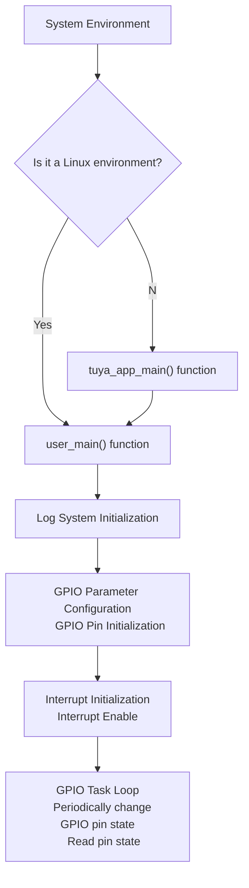

# GPIO

## GPIO Introduction

GPIO (General Purpose Input/Output) is a basic digital interface in embedded systems used for **controlling external devices or reading external signals**. Each GPIO pin can be configured by software as either input or output mode. In input mode, it can read the pin's level state (high or low); in output mode, it can control the pin to output high or low level.

## Key GPIO Concepts Explained

- GPIO Operating Modes
    - Input Mode: Pin is configured as input, used for reading external signal levels
    - Output Mode: Pin is configured as output, used for controlling external devices

- GPIO Level States
    - High Level: Typically represents logic 1, voltage close to supply voltage (e.g., 3.3V)
    - Low Level: Typically represents logic 0, voltage close to ground level (0V)

- GPIO Interrupt Function
    GPIO supports interrupt mechanism. When the pin level changes, it can trigger an interrupt handler function, enabling event-driven programming design.

## GPIO Usage Process

1. GPIO Parameter Configuration: Initialize the TUYA_GPIO_BASE_CFG_T structure as needed, setting the GPIO's **operating mode, direction, and electrical characteristics**

2. GPIO Initialization: Call the tkl_gpio_init() initialization function to make the configuration effective

3. GPIO Read/Write Operations: Use tkl_gpio_read() to **read the input pin state**; use tkl_gpio_write() to **control the output pin level**

If interrupt functionality needs to be enabled, after configuring the interrupt pin as input mode, the following additional configuration is required:

1. Initialize the irq_cfg interrupt configuration structure, setting the interrupt's **callback function**, **trigger mode**, etc.

2. Use the tkl_gpio_irq_init() initialization function to **make the interrupt configuration effective**

3. Use tkl_gpio_irq_enable() to **enable the interrupt**

## Example Code Configuration

### Development Board Configuration

Before using this example, confirm that the correct development board is selected in the GPIO **project root directory**.

- Development Board Selection Method:
    - Execute the board selection command in the project root directory, input the model of the development board to select:
        ```shell
        tos.py config choice
        ```
    - For example, to select TUYA_T5AI_CORE:
        Because **T5AI has multiple models**, such as TUYA_T5AI_CORE, TUYA_T5AI_BOARD, etc. After successfully selecting the T5AI development board using `tos.py config choice`, you must also use the `tos.py config menu` command to enter the configuration menu and continue selecting the T5AI sub-model under the `Choice a board` directory.

### GPIO Parameter Configuration

- Input/Output Configuration:

```c
    // Typical GPIO configuration structure is as follows:
    TUYA_GPIO_BASE_CFG_T out_pin_cfg = {
        .mode = TUYA_GPIO_PUSH_PULL,     // Push-pull output mode
        .direct = TUYA_GPIO_OUTPUT,      // Output direction
        .level = TUYA_GPIO_LEVEL_LOW     // Initial level is low
    };

    TUYA_GPIO_BASE_CFG_T in_pin_cfg = {
        .mode = TUYA_GPIO_PULLUP,        // Pull-up input mode
        .direct = TUYA_GPIO_INPUT,       // Input direction
    };
```

- Interrupt Configuration

```c
    // GPIO interrupt configuration structure:
    TUYA_GPIO_IRQ_T irq_cfg = {
        .cb = __gpio_irq_callback,       // Interrupt callback function
        .arg = NULL,                     // Callback function argument
        .mode = TUYA_GPIO_IRQ_RISE,      // Rising edge trigger
    };
```

## Compilation and Running

### Compilation Steps

1. Configure the TuyaOpen development environment and enter the **project root directory**

2. Ensure the target platform (T5AI/T3) is correctly selected

3. Execute the compilation command to generate the executable firmware

### Running and Logs

Burn the compiled firmware to the target device. After the device starts, use the following command to view the running logs:

```shell
tos.py monitor
```

Expected running logs:
```c
[01-01 00:00:00 ty I][example_gpio.c:xx] pin output high
[01-01 00:00:00 ty I][example_gpio.c:xx] GPIO read high level
[01-01 00:00:02 ty I][example_gpio.c:xx] pin output low
[01-01 00:00:02 ty I][example_gpio.c:xx] GPIO read low level
```

## Example Code Flow

1. System Initialization: If it's a Linux environment, directly call user_main(); otherwise, enter tuya_app_main() to create a user_main() thread

2. Log System Initialization: **Initialize the log system** via the tal_log_init() function

3. GPIO Parameter Configuration: Initialize the out_pin_cfg, in_pin_cfg, and irq_cfg structures, setting output pin, input pin, and interrupt pin parameters

4. GPIO Initialization and Interrupt Enable: Call the tkl_gpio_init() function for **GPIO initialization**, call the tkl_gpio_irq_init() function for **interrupt initialization**, call the tkl_gpio_irq_enable() function to **enable the interrupt**

5. Task Loop: Periodically change the output pin state; read the input pin state; handle interrupt events



## Main Interface Examples

The Tuya IoT platform provides **Hardware Abstraction Layer** (TAL, Tuya Abstract Layer) and **Hardware Driver Layer** (TKL, Tuya Kernel Layer) interfaces to uniformly access hardware resources.

- GPIO Initialization

    ```c
    OPERATE_RET tkl_gpio_init(TUYA_GPIO_NUM_E pin_id, CONST TUYA_GPIO_BASE_CFG_T *cfg);
    ```

    - Function: Initialize the specified GPIO pin

    - Parameters:
        pin_id: GPIO pin number
        cfg: Pointer to GPIO configuration parameters

    - Return value: Operation result status code
***
- GPIO Write Operation

    ```c
    OPERATE_RET tkl_gpio_write(TUYA_GPIO_NUM_E pin_id, TUYA_GPIO_LEVEL_E level);
    ```

    - Function: Set GPIO output level

    - Parameters:
        pin_id: GPIO pin number
        level: Output level (high/low)

    - Return value: Operation result status code
***
- GPIO Read Operation

    ```c
    OPERATE_RET tkl_gpio_read(TUYA_GPIO_NUM_E pin_id, TUYA_GPIO_LEVEL_E *level);
    ```

    - Function: Read GPIO input level

    - Parameters:
        pin_id: GPIO pin number
        level: Pointer to store the read level

    - Return value: Operation result status code
***
- GPIO Interrupt Initialization

    ```c
    OPERATE_RET tkl_gpio_irq_init(TUYA_GPIO_NUM_E pin_id, CONST TUYA_GPIO_IRQ_T *cfg);
    ```

    - Function: Initialize GPIO interrupt

    - Parameters:
        pin_id: GPIO pin number
        irq_cfg: Pointer to interrupt configuration structure

    - Return value: Operation result status code
***
- GPIO Interrupt Enable

    ```c
    OPERATE_RET tkl_gpio_irq_enable(TUYA_GPIO_NUM_E pin_id);
    ```

    - Function: Enable GPIO interrupt

    - Parameters: pin_id: GPIO pin number

    - Return value: Operation result status code
***
- GPIO Interrupt Disable

    ```c
    OPERATE_RET tkl_gpio_irq_disable(TUYA_GPIO_NUM_E pin_id)
    ```

    - Function: Disable GPIO interrupt

    - Parameters: pin: GPIO pin number

    - Return value: Operation result status code

## Supported Platforms

This example code demonstrates the basic usage of GPIO, including GPIO output control, input reading, and interrupt handling. It supports the following Tuya IoT development platforms:

| Platform Name | Core Features | Typical Application Scenarios |
|------|-------|-------|
| T5AI | High-computing-power AIoT platform, typically integrating DSP/NPU | Complex edge AI computing, image recognition, voice processing |
| T3 | General-purpose high-performance MCU platform, based on ARM Cortex-M series cores | Smart appliances and industrial control requiring strong processing capabilities |
| T2 | Cost-optimized general-purpose MCU platform | Basic smart home devices, sensor nodes |
| ESP32 | Popular IoT platform with integrated Wi-Fi and Bluetooth | Various IoT devices requiring wireless connectivity |
| LN882H | Domestic RISC-V architecture Wi-Fi SoC | Smart home, consumer electronics |
| BK7231X | Broadcom-integrated Wi-Fi IoT chip | Smart lighting, smart sockets, etc. |

## Precautions

- Electrical Characteristics: Pay attention to the **voltage range** and **drive capability** of GPIO pins to avoid overvoltage or overcurrent damage to the chip

- Interrupt Handling: Avoid time-consuming operations in the interrupt callback function; **process quickly and return**

- Pin Conflicts: When configuring GPIO functions, pay attention to **avoid pin function conflicts**, especially for multiplexed function pins

- Level Compatibility: Pay attention to level compatibility when connecting external devices; add level conversion circuits if necessary

- Anti-interference Design: Consider adding filter circuits and protection circuits for long-distance transmission or harsh environments

For more information, please visit the link
 https://tuyaopen.ai/zh/docs/peripheral/support_peripheral_list