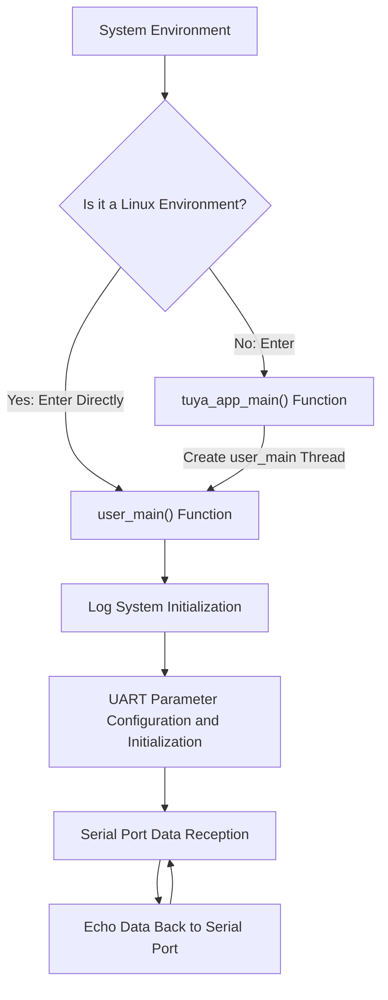

# UART

## UART Introduction

UART: Universal Asynchronous Receiver/Transmitter, is an **asynchronous serial communication protocol** used for **full-duplex or half-duplex serial** data transmission between devices. It exchanges data through the transmit line (TX) and receive line (RX), **requiring no clock signal for synchronization**, relying instead on predefined parameters for communication. Widely used for communication between microcontrollers, computers, and other digital devices, it is valued for its simplicity, reliability, and flexibility, serving as a bridge connecting different devices.

## UART Key Concepts Explained

-   Baud Rate: Represents the **number of symbols transmitted per second**, i.e., the communication rate, measured in bps (bits per second). Common baud rates include 9600, 115200, etc. Communication parties must set the same baud rate to correctly decode data.
-   Data Bits: A parameter indicating the **number of actual data bits** in the communication, representing the number of data bits contained in each character. Standard values can be 5, 6, 7, 8, or 9 bits, typically set to 8 bits, matching the bit length of an ASCII character.
-   Stop Bits: Used to **mark the end of a data frame**, can be 1, 1.5, or 2 bits of logic high level. Stop bits not only indicate the end of transmission but also provide time for the receiver to perform internal processing.
-   Parity Bit: An optional **error detection bit**. After adding this bit to the data bits, the total number of '1' bits should be even (even parity) or odd (odd parity), used to verify the correctness of data transmission.

A complete UART data frame consists of a start bit (1 bit logic low level), data bits (5-9 bits), an optional parity bit (1 bit), and stop bits (1-2 bits logic high level).

<figure style="text-align: center">
  
  <figcaption style="font-size: 0.8em; color: #666">UART Communication Timing Diagram | Source: <a href="Link1">Blog Garden</a></figcaption>
</figure>


## UART Usage Process

1.  UART Parameter Configuration: Select UART, **initialize the cfg structure**, set baud rate, data bits, stop bits, etc.
2.  UART Initialization: Call the `tal_uart_init()` function for **UART initialization**.
3.  Data Transmission and Reception: Use `tal_uart_write()` to send data to the specified serial port, use `tal_uart_read()` to read data from the specified serial port.
4.  Resource Cleanup: After operations are complete, if UART is no longer needed, call `tal_uart_deinit` to **release resources**.

## Relevant Hardware Information

-   UART0: Typically used for firmware burning, it is not recommended to **occupy** or **reconfigure** it in application-layer programs to avoid affecting the burning process.
-   UART1: Generally used for **log printing** in applications, it is not recommended to **occupy** or **reconfigure** it in application-layer programs.
-   Voltage Level: Note that the UART pins of the MCU are usually **TTL level** (3.3V or 5V). If connecting to RS232 devices, a level conversion chip is required.
-   Pin Assignment: For specific UART pin assignments, please refer to the hardware schematic or datasheet of the corresponding target platform (T5AI/T3).

## Example Code Configuration

### Development Board Configuration

Before using this example, confirm that the correct development board is selected in the **project root directory** of the UART project.

-   Development Board Selection Method:
    -   Execute the development board selection command in the project root directory, and enter the model of the development board to be selected:
        ```shell
        tos.py config choice
        ```
    -   For example, to select TUYA_T5AI_CORE:
        Because **T5AI has multiple models**, such as TUYA_T5AI_CORE, TUYA_T5AI_BOARD, etc. After successfully selecting a T5AI development board using `tos.py config choice`, you must also use the `tos.py config menu` command to enter the configuration menu and continue selecting the T5AI sub-model under the `Choice a board` directory.

### UART Parameter Configuration:

-   UART Selection:
    Specify the serial port number during serial port initialization and data transmission/reception (macro definitions can be used). For example, to use UART0, define the macro `#define USR_UART_NUM TUYA_UART_NUM_0`, then specify the port `USR_UART_NUM` during initialization and data transmission/reception.

-   UART Parameter Configuration:

    ```c
        // Typical UART configuration parameters (set in the corresponding configuration file or code)
        TAL_UART_CFG_T cfg = {0}; // Serial port configuration structure
        cfg.base_cfg.baudrate = 115200; // Baud rate
        cfg.base_cfg.databits = TUYA_UART_DATA_LEN_8BIT; // Data bits
        cfg.base_cfg.stopbits = TUYA_UART_STOP_LEN_1BIT; // Stop bits
        cfg.base_cfg.parity = TUYA_UART_PARITY_TYPE_NONE; // Parity
        cfg.rx_buffer_size = 256; // Receive buffer size
        cfg.open_mode = O_BLOCK; // Serial port mode, blocking mode
    ```

## Compilation and Running

### Compilation Steps

1.  Set up the TuyaOpen development environment and navigate to the **project root directory**.
2.  Ensure the target platform (T5AI/T3) is correctly selected.
3.  Compile the project to generate the executable firmware.

### Running and Logs

Burn the compiled firmware onto the target device. After the device starts, use `tos.py monitor -b 115200` to enter log mode, with a baud rate of 115200 (set according to the actual UART baud rate setting). When selecting the serial port device, choose based on the corresponding **hardware information**. For example, for TUYA_T5AI_CORE, UART0 is the burning serial port, and UART1 is the log serial port (not recommended for other uses). If testing UART0 functionality, select the tty device used for burning.

Expected running log (viewed via the burning UART, e.g., UART0):

```c
Please input text:

123456
> 123456
```

(Note: Actual log content may vary depending on the specific implementation and configuration.)

## Example Code Flow

1.  System Initialization: If it's a Linux environment, directly call `user_main()`; otherwise, enter `tuya_app_main()` to create a `user_main()` thread.
2.  Log System Initialization: **Initialize the log system** via the `tal_log_init()` function.
3.  UART Parameter Configuration: Initialize the cfg **serial port parameter configuration structure**, setting communication parameters like baud rate, data bits, stop bits, parity, etc.
4.  UART Initialization: Call the `tal_uart_init()` function, passing the initialized cfg structure, to **initialize the serial port**.
5.  Data Reception: Call the `tal_uart_read()` function to receive data. In the example code, if no data is received (`read_len <= 0`), it sleeps for 10ms and continues the loop.
6.  Data Transmission: Call the `tal_uart_write()` function to send data, echoing the received data back to the serial port.



## Main Interface Examples

The Tuya IoT platform provides **Hardware Abstraction Layer (TAL, Tuya Abstract Layer)** and **Hardware Driver Layer (TKL, Tuya Kernel Layer)** interfaces to uniformly access hardware resources.

(The following interfaces are based on common TAL UART operations; specific function names should refer to the latest documentation.)

-   Initialize UART:

    ```c
    OPERATE_RET tal_uart_init(TUYA_UART_NUM_E port_num, TAL_UART_CFG_T *cfg);
    ```

    -   Function: **Initialize** the specified UART port.
    -   Parameters:
        -   `port_num`: UART port number (e.g., `TUYA_UART_NUM_0`).
        -   `cfg`: Pointer to the UART configuration structure.
    -   Return Value: Operation result status code.
    -   Configuration Structure:
        ```c
        typedef struct {
            TAL_UART_BASE_CFG_T base_cfg;  // Base configuration
            UINT_T rx_buffer_size;         // Receive buffer size
            INT_T open_mode;               // Open mode (e.g., O_BLOCK)
        } TAL_UART_CFG_T;
        ```

***

-   UART Data Transmission:

    ```c
    INT_T tal_uart_write(TUYA_UART_NUM_E port_num, const UINT8_T *data, UINT_T len);
    ```

    -   Function: **Send data** to the specified UART port.
    -   Parameters:
        -   `port_num`: UART port number (e.g., `TUYA_UART_NUM_0`).
        -   `data`: Pointer to the data to be sent.
        -   `len`: Data length (in bytes).
    -   Return Value: Number of bytes **actually sent**.

***

-   UART Data Reception:

    ```c
    INT_T tal_uart_read(TUYA_UART_NUM_E port_num, UINT8_T *data, UINT_T len);
    ```

    -   Function: **Read data** from the specified UART port.
    -   Parameters:
        -   `port_num`: UART port number (e.g., `TUYA_UART_NUM_0`).
        -   `data`: Pointer to the receive data buffer.
        -   `len`: Maximum length **expected to read**.
    -   Return Value: Number of bytes **actually read**.

***

-   UART Deinitialization:

    ```c
    OPERATE_RET tal_uart_deinit(TUYA_UART_NUM_E port_num);
    ```

    -   Function: **Close and release** UART resources.
    -   Parameters:
        -   `port_num`: UART port number (e.g., `TUYA_UART_NUM_0`).
    -   Return Value: Returns the operation status code, where 0 indicates success, and other values indicate failure.

## Precautions

-   Ensure that parameters such as baud rate, data bits, stop bits, and parity bit are completely consistent between the communicating parties (e.g., MCU and module).
-   In long-distance communication or environments with significant interference, consider using parity checks or hardware flow control (e.g., RTS/CTS) to improve data reliability.
-   When handling received data, it is recommended to use a ring buffer or interrupt mechanism to improve system efficiency and prevent data loss.
-   In actual development, please adjust the code and use the correct interfaces according to the specific API documentation provided by the Tuya IoT platform.

## Supported Platforms

This example code functions to echo the content sent to UART0 and supports the following Tuya IoT development platforms:

| Platform Name | Core Features | Typical Application Scenarios |
| :------------ | :------------ | :---------------------------- |
| T5AI          | High-performance AIoT platform, often integrating DSP/NPU | Complex edge AI computing, image recognition, speech processing |
| T3            | General-purpose high-performance MCU platform, based on ARM Cortex-M series cores | Smart appliances and industrial control requiring strong processing capabilities |
| T2            | Cost-optimized general-purpose MCU platform | Basic smart home devices, sensor nodes |
| ESP32         | Popular IoT platform with integrated Wi-Fi and Bluetooth | Various IoT devices requiring wireless connectivity |
| LN882H        | Domestic RISC-V architecture Wi-Fi SoC | Smart home, consumer electronics |
| BK7231X       | Broadcom-integrated Wi-Fi IoT chip | Smart lighting, smart sockets, etc. |

For more information, go to Link
https://tuyaopen.ai/zh/docs/peripheral/support_peripheral_list