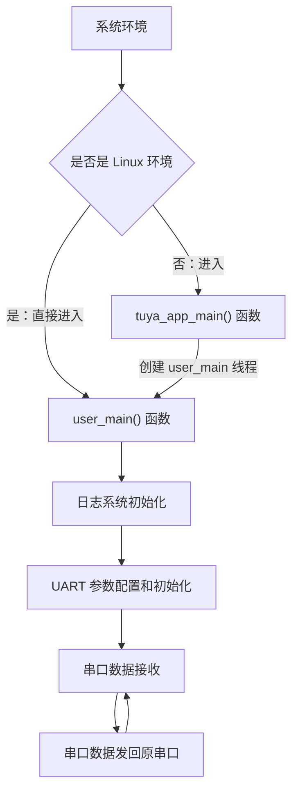

# UART

## UART 简介

UART: 通用异步收发传输器（Universal Asynchronous Receiver/Transmitter），是一种**异步串行通信协议**，用于设备间的**全双工或半双工串行**数据传输。它通过发送线（TX）和接收线（RX）进行数据交换，**不需要时钟信号同步**，而是依靠预定义的参数进行通信。广泛应用于微控制器、计算机和其他数字设备之间的通信，以其简单、可靠和灵活的特性成为连接不同设备间的桥梁。

## UART 关键概念解释

- 波特率（Baud Rate）: 表示**每秒传输的符号数**，即通信速率，单位是 bps（bits per second）。常见的波特率有9600、115200等。通信双方必须设置相同的波特率才能正确解码数据。

- 数据位（Data Bits）: 衡量通信中**实际数据位**的参数，表示每个字符中包含的数据位数。标准值可以是5、6、7、8或9位，通常设置为8位，与一个 ASCII 字符的位数相同。

- 停止位（Stop Bits）: 用于**标识一帧数据的结束**，可以是1位、1.5位或2位的逻辑高电平。停止位不仅表示传输结束，还为接收器提供进行内部处理的时间。

- 奇偶校验位（Parity Bit）: 可选的**错误检测位**。数据位加上这一位后，使得“1”的位数应为偶数（偶校验）或奇数（奇校验），以此来校验数据传送的正确性。

一个完整的 UART 数据帧由起始位（1位逻辑低电平）、数据位（5-9位）、可选的奇偶校验位（1位）和停止位（1-2位逻辑高电平）组成。

<figure style="text-align: center">
  
  <figcaption style="font-size: 0.8em; color: #666">UART 通信时序图 | 来源：<a href="https://www.cnblogs.com/redraincontrol/p/18697606">博客园</a></figcaption>
</figure>

## UART 使用流程

1. UART 参数配置：选择 UART ，**初始化 cfg 结构体**，设置波特率、数据位、停止位等

2. UART 初始化：调用 tal_uart_init() 函数进行 **UART 初始化**

3. 数据收发：使用 tal_uart_write() 向指定串口发送数据，使用 tal_uart_read() 从指定串口读取数据

4. 资源回收：操作完成后，若不再使用 UART ，可调用 tal_uart_deinit **释放资源**

## 相关硬件信息

- UART0: 通常用于烧录固件，不建议在应用层程序中**占用**或**重新配置**，以免影响烧录

- UART1: 一般用于应用程序的**日志打印**，不建议在应用层程序中**占用**或**重新配置**

- 电压电平: 注意 MCU 的 UART 引脚通常是 **TTL 电平**（3.3V或5V），如需连接 RS232 设备，需使用电平转换芯片

- 引脚分配: 具体 UART 引脚分配请参考对应目标平台（T5AI/T3）的硬件原理图或数据手册

## 示例代码配置

### 开发板配置

在使用本例程前，需在 UART **项目根目录**中确认开发板是否选择正确。

- 开发板选择方法：

    - 在项目根目录中执行开发板选择命令，输入要选择的开发板的型号：

        ```shell
        tos.py config choice
        ```

    - 比如要选择 TUYA_T5AI_CORE ：

        因为**T5AI 有多个型号**，如 TUYA_T5AI_CORE 、 TUYA_T5AI_BOARD等。在使用 `tos.py config choice` 成功选择 T5AI 开发板后,还要使用 `tos.py config menu` 命令进入配置菜单，在 `Choice a board` 目录下继续选择 T5AI的子型号。

### UART参数配置：

- UART 选择：

    在串口初始化和数据收发时指定串口号（可以使用宏定义），比如要使用 UART0，宏定义 `#define USR_UART_NUM      TUYA_UART_NUM_0` ，然后在初始化和数据收发时指定端口 `USR_UART_NUM`


- UART 参数配置：

    ```c
        // 典型的UART配置参数 (在相应的配置文件或代码中设置)
        TAL_UART_CFG_T cfg = {0}; //串口配置结构体
        cfg.base_cfg.baudrate = 115200;//波特率
        cfg.base_cfg.databits = TUYA_UART_DATA_LEN_8BIT;//数据位
        cfg.base_cfg.stopbits = TUYA_UART_STOP_LEN_1BIT;//停止位
        cfg.base_cfg.parity = TUYA_UART_PARITY_TYPE_NONE;
        cfg.rx_buffer_size = 256;//接收缓冲区大小
        cfg.open_mode = O_BLOCK;//串口模式，阻塞模式
    ```

## 编译与运行

### 编译步骤

1.  配置好 TuyaOpen 开发环境，进入到**项目根目录**

2.  确保目标平台（ T5AI/T3 ）选择正确

4.  编译工程，生成可执行固件

### 运行及日志

将编译好的固件烧录到目标设备。设备启动后，使用 tos.py monitor -b 115200 进入日志模式，波特率为115200（具体按照UART波特率设置）。选择串口设备时，根据相应的**硬件信息**选择。比如 TUYA_T5AI_CORE 的UART0为烧录串口，UART1 为日志串口(不推荐用作其他用途)，我要测试 UART0 的功能，就选择烧录用的 tty 设备

预期运行日志（通过串口烧录 UART，例如 UART0 查看）：

```c
Please input text:

123456
> 123456
```

(注意：实际日志内容可能因具体实现和配置而异)

## 示例代码流程

1. 系统初始化：如果是 Linux 环境，直接调用 user_main()；其他环境则进入 tuya_app_main() 创建 user_main() 线程

2. 日志系统初始化：通过 tal_log_init() 函数**初始化日志系统**

3. UART 参数配置：初始化 cfg **串口参数配置结构体**，设置波特率、数据位、停止位、校验位等通信参数

4. UART 初始化：调用 tal_uart_init() 函数，传入 初始化好的 cfg 结构体，对**串口初始化**

5. 数据接收：调用 tal_uart_read() 函数接收数据。示例代码中未接收到数据（ read_len <= 0）睡眠 10ms 后继续循环

6. 数据发送：调用 tal_uart_write() 函数发送数据，将接收到的数据发回串口



## 主要接口举例

涂鸦IoT平台提供了**硬件抽象层**（TAL, Tuya Abstract Layer）和**硬件驱动层**（TKL, Tuya Kernel Layer）接口来统一访问硬件资源。

（以下接口基于常见的TAL UART操作，具体函数名请参照最新版本文档）

- 初始化 UART：

    ```c
    OPERATE_RET tal_uart_init(TUYA_UART_NUM_E port_num, TAL_UART_CFG_T *cfg); 
    ```
    
    - 功能: **初始化**指定的 UART 端口

    - 参数：

        port_num: UART 端口号（如 TUYA_UART_NUM_0 ）

        cfg: 指向UART配置结构体的指针
    
    - 返回值: 操作结果状态码

    - 配置结构体：

        ```c
        typedef struct {
            TAL_UART_BASE_CFG_T base_cfg;  // 基础配置
            UINT_T rx_buffer_size;         // 接收缓冲区大小
            INT_T open_mode;               // 打开模式(如O_BLOCK)
        } TAL_UART_CFG_T;
        ```
***
- UART 数据发送：

    ```c
    INT_T tal_uart_write(TUYA_UART_NUM_E port_num, const UINT8_T *data, UINT_T len); 
    ```

    - 功能: 向指定的 UART 端口**发送数据**

    - 参数：

        port_num: UART 端口号（如 TUYA_UART_NUM_0 ）

        data: 要发送的数据指针

        len: 数据长度（单位：字节）
    
    - 返回值: **实际发送**的字节
***
- UART 数据接收：

    ```c
    INT_T tal_uart_read(TUYA_UART_NUM_E port_num, UINT8_T *data, UINT_T len);
   ```
    
    - 功能: 从指定的 UART 端口**读取数据**

    - 参数：

        port_num: UART 端口号（如 TUYA_UART_NUM_0 ）

        data: 接收数据缓冲区的指针

        len: **期望读取**的最大长度
    
    - 返回值: **实际读取**的字节
***
- UART 反初始化：

    ```c
    OPERATE_RET tal_uart_deinit(TUYA_UART_NUM_E port_num);
    ```

    - 功能: **关闭并释放** UART 资源

    - 参数：

        port_num: UART 端口号（如 TUYA_UART_NUM_0 ）
    
    - 返回值: 返回操作状态码，0为成功，其他值为失败

## 注意事项

- 确保通信双方（如MCU与模组）的波特率、数据位、停止位、校验位等参数完全一致。

- 在长距离通信或干扰较大环境中，考虑使用奇偶校验或硬件流控制（如RTS/CTS）以提高数据可靠性。

- 处理接收数据时，建议使用环形缓冲区或中断机制，以提高系统效率并防止数据丢失。

- 实际开发中，请根据涂鸦IoT平台提供的具体API文档调整代码和使用正确的接口。

## 支持的平台

此示例代码作用是是回显UART0的发送内容，支持以下涂鸦 IoT 开发平台：

|平台名称|核心特性|典型应用场景|
|------|-------|-------|
|​T5AI​​|高算力 AIoT 平台，通常集成 DSP/NPU|复杂的边缘AI计算、图像识别、语音处理|
|​T3|通用高性能 MCU 平台，基于 ARM Cortex-M 系列内核|需要较强处理能力的智能家电、工业控制|
|​T2​​ |成本优化的通用 MCU 平台 |基础的智能家居设备、传感器节点|
|​ESP32​​| 集成 Wi-Fi 和蓝牙的流行物联网平台| 需要无线连接的各种物联网设备|
|LN882H​​ |国产 RISC-V| 架构 Wi-Fi SoC 智能家居、消费电子|
|​BK7231X​​ |博通集成 Wi-Fi 的物联网芯片 |智能照明、智能插座等|

获取更多信息，请到 https://tuyaopen.ai/zh/docs/peripheral/support_peripheral_list